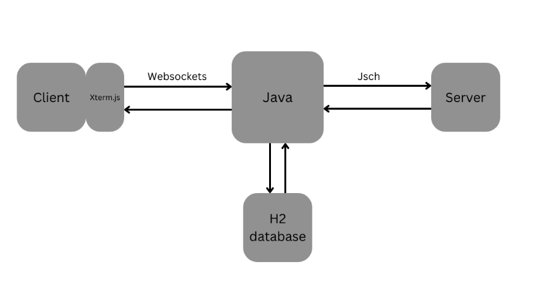
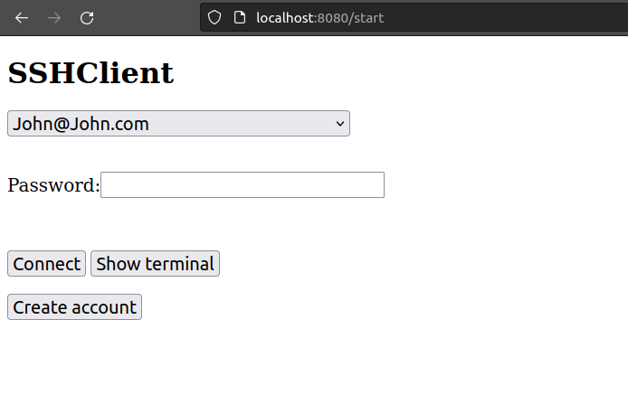
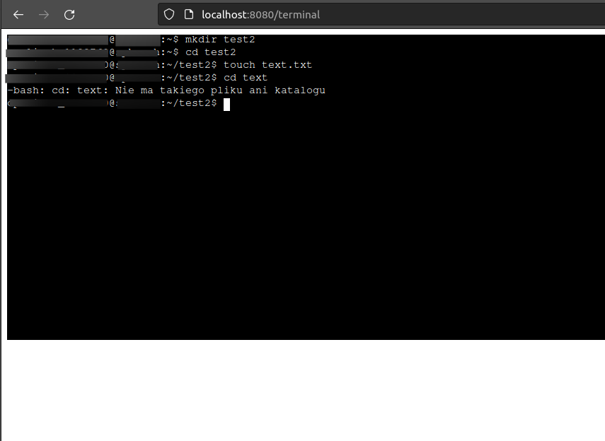
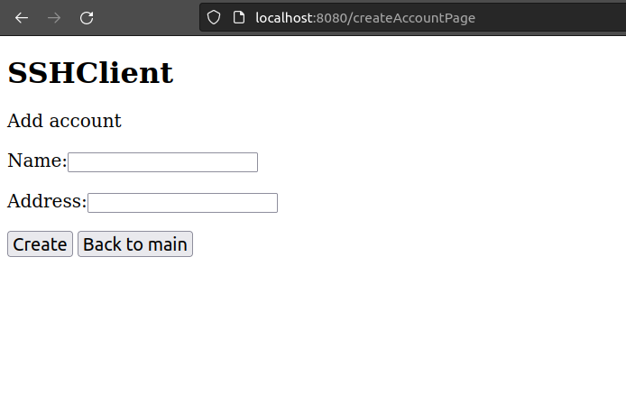
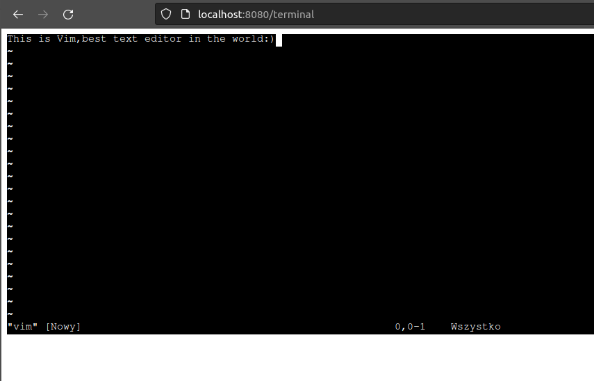

# SSHClient

This is a web application that allows you to
connect to a server via a graphical web terminal.
Application is based on Spring Boot.

To download
------------
	git clone https://github.com/OpalinskiJakub/SSHClient.git

To start
------------
	mvn spring-boot:run

To run tests
------------
	mvn test

Application structure:
------------
	mvn test

Application works on http://localhost:8080/start

List of used technologies: 
-Java 
-Spring 
-JSch 
-Websockets 
-Javascript 
-HTML 
-Xterm.js 
-H2 database 

